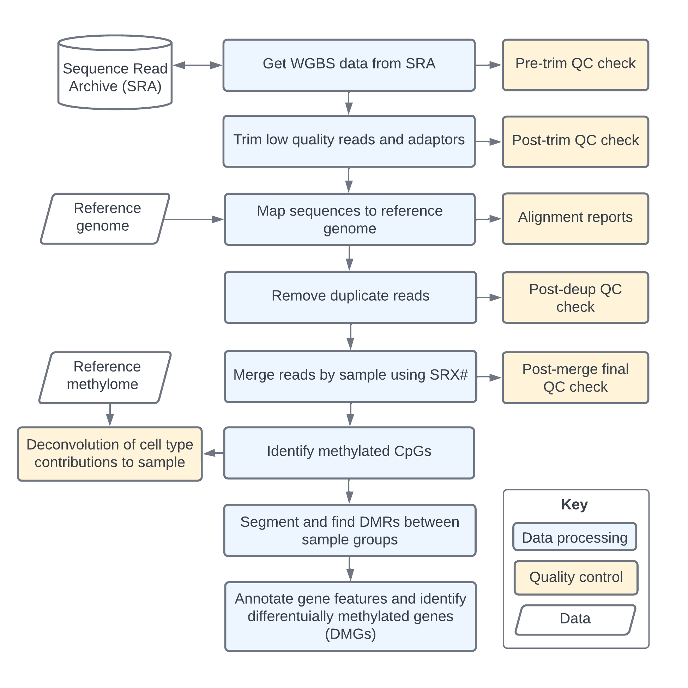

# DMReproducible: automating differential methylation analysis of DNA methylation sequencing data

A restructured version of DMRworkflow that is intended to split out workflow functionality into 3 subunits:

1. initialize: downloads reference and sample fastqs, and indexes genome references for alignment.
2. secondary: aligns samples to reference, identifies DMRs, annotates gene features to DMRs, and runs basic QC checks.
3. tertiary: creates plots and reports data to final output report.

Note: This workflow is a work in progress and is being developed as part of a [graduate research project](supplementary/project_background.md) to analyze whole genome bisulfite sequencing (WGBS) data from the Sequence Read Archive (SRA).

DMReproducible uses Snakemake workflow management in conjunction with Slurm workload manager to improve the automation and reproducibility of genomic data analysis on an HPC.

### Analysis steps included in pipeline

The snakemake workflow includes a 3 subworkflows that download fastq files from SRA, run QC checks, trimming, alignment, methylation calling, and plotting of results.

For human WGBS data analysis, the secondary subworkflow requires compute resources that are generally not available locally. All 3 subworkflows have been configured to run on an HPC cluster using slurm for resource management (see the cluster.yaml for details on resources allotted to each rule).

The output files from the secondary subworkflow are portable `.beta` files that contain the methylation beta values for each CpG site in the genome.
The tertiary snakemake workflow requires far less computing resources and can be carried out locally to identify differentially methylated regions (DMRs) associated with a group of samples relative to the background/control group.
Differentially methylated genes (DMGs) are identified as the gene associated with promoters within DMRs.

#### Simplified overview of pipeline

### Setup

*This pipeline is a work and progress and instructions for setup will be updated as the pipeline is developed.*

##### Dependencies

* python 3.11.4
* conda 23.5.0
  * Automatically manages all Snakemake rule dependencies as specified in `.yaml` files.
  * The `mamba` package manager could be used in place of `conda` for faster dependency resolution.
* snakemake version 7.28.3
  * Create a snakemake environment with `conda create -n snakemake -c conda-forge -c bioconda snakemake`
* wgbstools version 0.2.0
  * This package must be set up, compiled, and in path following the instructions in the [wgbstools repository](https://github.com/nloyfer/wgbs_tools).
  * You do not need to initialize a reference genome with wgbstools, as the pipeline will do this for you.

*More set up and usage instructions to come...*
